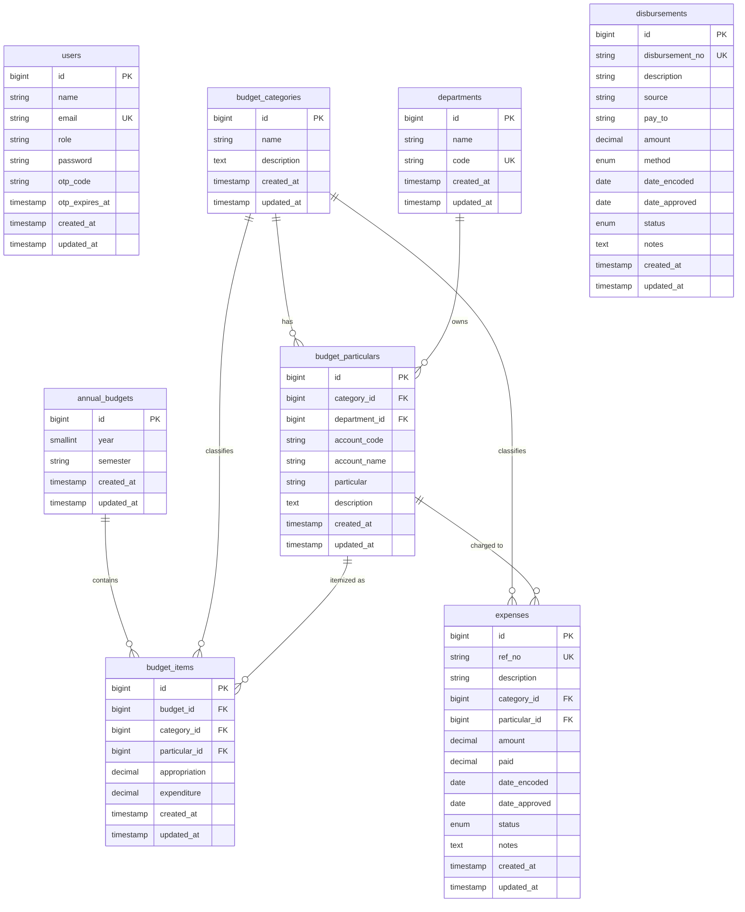

# Entity Relationship Diagram (ERD)

> Covers all domain tables. Laravel system tables (cache, sessions, jobs, password_reset_tokens) are excluded.

## Notes

| Column | Detail |
|---|---|
| `users.role` | `super_admin` \| `budget_officer` \| `disbursement_officer` \| `auditor` |
| `annual_budgets.(year, semester)` | Composite unique key — one budget per year/semester |
| `expenses.ref_no` | Auto-generated as `EXP########` (e.g., `EXP00000001`) |
| `disbursements.disbursement_no` | Auto-generated as `DSB########` |
| `expenses.status` | `pending` \| `approved` \| `cancelled` |
| `disbursements.status` | `pending` \| `approved` \| `posted` \| `cancelled` |
| `disbursements.method` | `check` \| `cash` \| `bank_transfer` |
| `budget_items.expenditure` | Planned/tracked expenditure per line item (not linked to Expense rows) |
