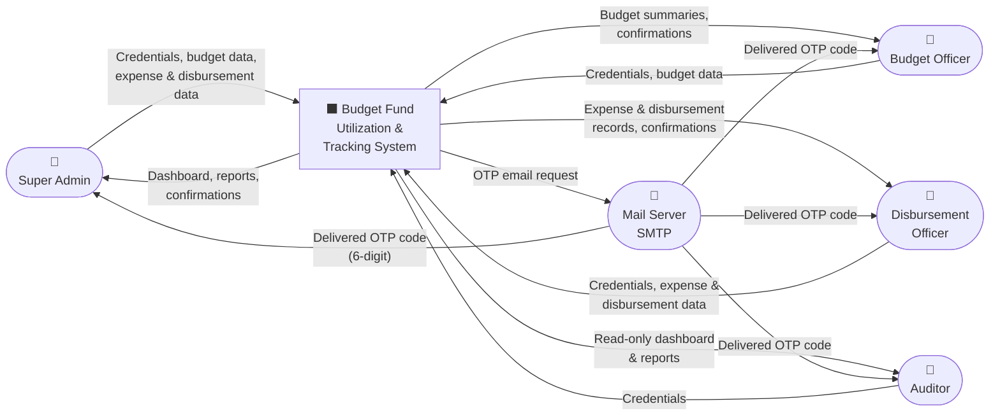

# DFD Level 0 — Context Diagram

> Shows the system as a single process, all external entities, and the high-level data flows between them.

## External Entities

| Entity | Role in System |
|---|---|
| **Super Admin** | Full access — all CRUD + view |
| **Budget Officer** | Manages budget, categories, particulars, departments |
| **Disbursement Officer** | Manages expenses and disbursements |
| **Auditor** | Read-only access to all data |
| **Mail Server (SMTP)** | Delivers OTP codes for 2FA on every login |
