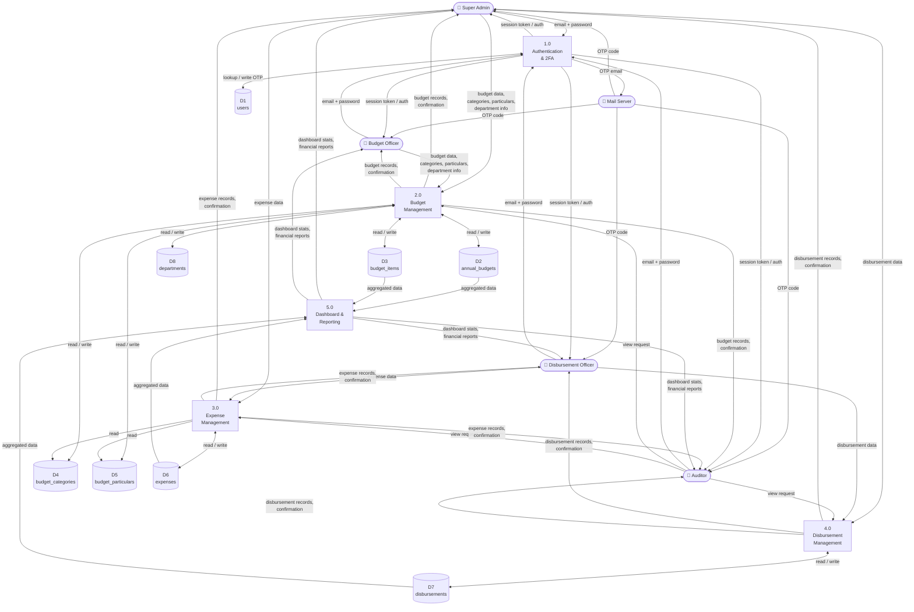

# DFD Level 1 — Process Decomposition

> Expands the single system bubble from Level 0 into five internal processes, showing data stores and flows between them.

## Process Descriptions

| Process | Description |
|---|---|
| **1.0 Authentication & 2FA** | Validates credentials against `users`, generates a 6-digit OTP, emails it via SMTP, then verifies OTP before granting a session |
| **2.0 Budget Management** | CRUD for `annual_budgets`, `budget_items`, `budget_categories`, `budget_particulars`, and `departments` |
| **3.0 Expense Management** | CRUD for `expenses`; auto-generates `ref_no` (EXP########); reads categories and particulars for classification |
| **4.0 Disbursement Management** | CRUD for `disbursements`; tracks payment method, payee, and approval status |
| **5.0 Dashboard & Reporting** | Aggregates totals (appropriation, expenditure, balance), utilization rates per category, and recent activity feeds |
