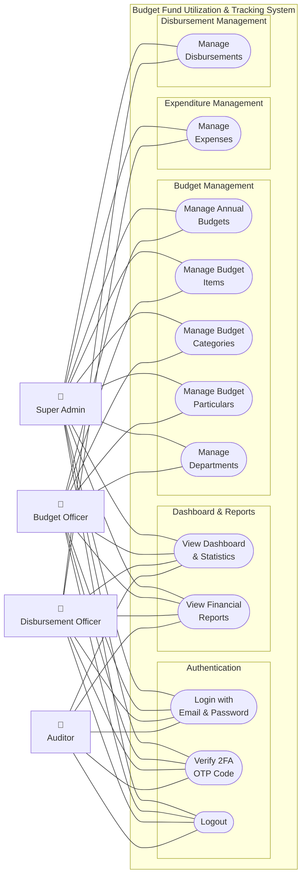

# Use Case Diagram

> Shows all system use cases and which actors can perform them.

## Actor–Use Case Matrix

| Use Case | Super Admin | Budget Officer | Disbursement Officer | Auditor |
|---|:---:|:---:|:---:|:---:|
| Login with Email & Password | ✅ | ✅ | ✅ | ✅ |
| Verify 2FA OTP Code | ✅ | ✅ | ✅ | ✅ |
| Logout | ✅ | ✅ | ✅ | ✅ |
| View Dashboard & Statistics | ✅ | ✅ | ✅ | ✅ |
| View Financial Reports | ✅ | ✅ | ✅ | ✅ |
| Manage Annual Budgets | ✅ | ✅ | — | — |
| Manage Budget Items | ✅ | ✅ | — | — |
| Manage Budget Categories | ✅ | ✅ | — | — |
| Manage Budget Particulars | ✅ | ✅ | — | — |
| Manage Departments | ✅ | ✅ | — | — |
| Manage Expenses | ✅ | — | ✅ | — |
| Manage Disbursements | ✅ | — | ✅ | — |

> "Manage" = Create, Read, Update, Delete. Auditor has read-only access via the dashboard and reports.
