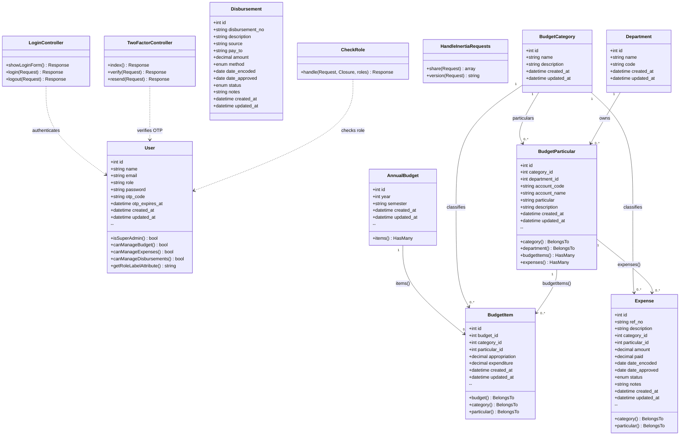

# Class Diagram

> Based on Eloquent models in `app/Models/`. Includes relationships, key attributes, and public methods.

## Enumerations

| Class | Field | Values |
|---|---|---|
| `Expense` | `status` | `pending`, `approved`, `cancelled` |
| `Disbursement` | `status` | `pending`, `approved`, `posted`, `cancelled` |
| `Disbursement` | `method` | `check`, `cash`, `bank_transfer` |
| `User` | `role` | `super_admin`, `budget_officer`, `disbursement_officer`, `auditor` |
