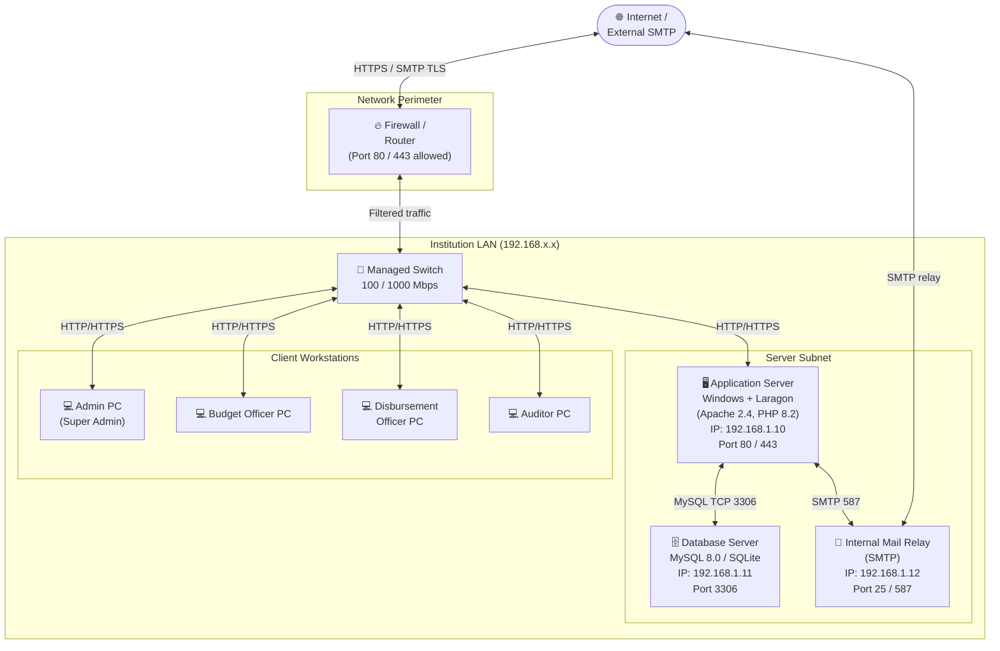

# Network Topology

> Depicts the physical/logical network layout for a typical institutional LAN deployment of this system.

## Node Reference

| Node | Role | Protocol / Port |
|---|---|---|
| Firewall / Router | Perimeter security, NAT, port filtering | HTTP 80, HTTPS 443 |
| Application Server | Runs Apache + PHP 8.2 + Laravel 12 + Queue Worker | HTTP/HTTPS |
| Database Server | Stores all application data (MySQL or SQLite file on same host) | TCP 3306 (MySQL) |
| Internal Mail Relay | Routes OTP emails to users; relays to external SMTP if needed | SMTP 25 / 587 |
| Client Workstations | Access the web application through a browser — no software install | HTTPS |

## Notes

- For a **Laragon local setup** (development), the Application Server and Database run on the same Windows machine on `localhost`.
- In **production**, separating the DB to its own host (or using MySQL on the same server) is recommended.
- All user-facing traffic should be served over **HTTPS** (TLS/SSL certificate required on the Application Server).
- The Queue Worker (`php artisan queue:listen`) runs as a background process on the Application Server and handles OTP mail dispatch asynchronously.
