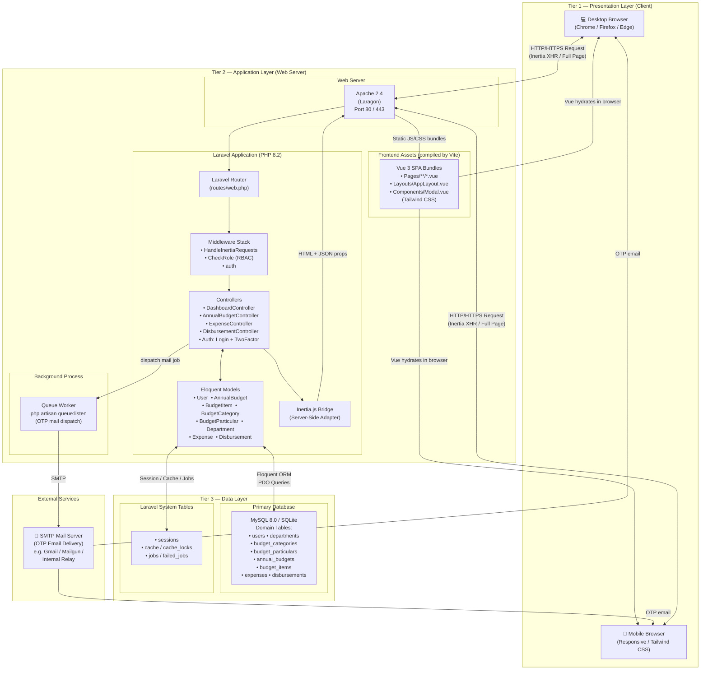

# Physical Architecture

> Three-tier deployment architecture showing the Presentation, Application, and Data tiers.



## Component Responsibilities

| Component | Technology | Responsibility |
|---|---|---|
| Browser Client | Any modern browser | Renders Vue 3 SPA pages; sends Inertia XHR requests on navigation |
| Apache Web Server | Apache 2.4 (Laragon) | Accepts HTTP/S connections; routes all requests to Laravel's `public/index.php` |
| Laravel Router | Laravel 12 | Maps URLs to controller methods; applies middleware groups |
| Middleware Stack | Laravel + Custom | `HandleInertiaRequests` shares global props (auth, permissions, flash); `CheckRole` enforces RBAC |
| Controllers | PHP 8.2 | Fetch data via Eloquent, run validation, return `Inertia::render()` responses |
| Eloquent Models | Laravel ORM | Define schema relationships, casts, and helper methods |
| Inertia.js Bridge | inertiajs/inertia-laravel | Converts controller responses to JSON props for the Vue frontend on XHR; returns full HTML on first load |
| Vue 3 Pages | @inertiajs/vue3 + Vite | SPA pages compiled by Vite; `AppLayout.vue` wraps all authenticated pages |
| Queue Worker | Laravel Queue | Processes mail jobs from the `jobs` table; sends OTP emails via SMTP asynchronously |
| Database | MySQL 8.0 / SQLite | Persists all application data; also stores sessions, cache, and queue jobs |
| SMTP Mail Server | Configurable | Delivers OTP emails; configured in `.env` via `MAIL_*` variables |

## Data Flow Summary

```
Browser  ──POST /login──►  Laravel  ──validate──►  DB (users)
                                    ──generate OTP──►  DB (users.otp_code)
                                    ──dispatch job──►  Queue Worker  ──►  SMTP  ──►  User Email
Browser  ──POST /2fa/verify──►  Laravel  ──check OTP──►  DB
                                         ──Auth::login()──►  Session (DB)
Browser  ──GET /annual-budgets──►  Inertia  ──props──►  Vue Page renders
```
